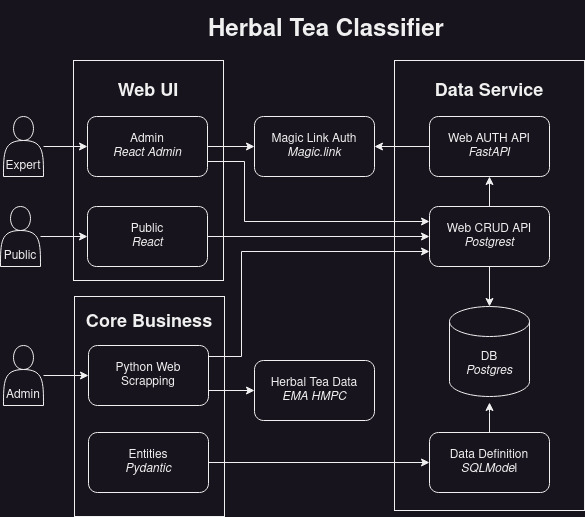

# Example of PostgREST on a Python Stack

## Core Concept

This repository is a proof of concept for an application stack that drastically minimized
the code needed to handle CRUD opetations. It levereages the great [PostgREST](https://postgrest.org)
on a Python stack powered by [Pydantic](https://docs.pydantic.dev) with [SQLModel](https://sqlmodel.tiangolo.com/) 
and [FastAPI](https://fastapi.tiangolo.com/).

It implements an Herbal Tea classification web application based on 
[EMA HMPC](https://www.ema.europa.eu/en/committees/committee-herbal-medicinal-products-hmpc) data.

The main idea is to simply declare the Data Definition Language in Python, then SQLModel and PostgREST will automatically build the CRUD API. Thanks to Pydantic integration, the schema of resources served by the CRUD API can be seamlessly used in other Python-based services, especially with FastAPI.

The code is structured following the [Clean Architecture](https://blog.cleancoder.com/uncle-bob/2012/08/13/the-clean-architecture.html) principles.
All the entities are describe as Pydantic models. 
With a very little code, those entities definition are used to build the PostgREST service.

## Architecture

## Tools

To make data operations even simpler, this stack leverages other useful tools, including:

- [React Admin](https://marmelab.com/react-admin/) for data administration, helped by the [PostgREST Data Provider For React-Admin](https://github.com/raphiniert-com/ra-data-postgrest) (`tools/react/admin` folder).
- [Magic Link](https://magic.link/) authentication service to avoid deal with passwords.
- An auth API (`tools/fastapi/auth-api` folder) based on FastAPI that transforms magic.link token into JWT (required by PostGREST).
- An CLI app using [Typer](https://typer.tiangolo.com/) (`herbaltea-classifier/herbaltea_classifier/adapters/cli.py`).
- Terraform scripts to deploy on [Scaleway](https://www.scaleway.com/en/) (`tools/terraform`).